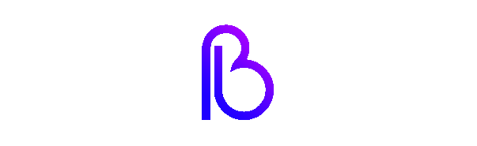

[Twitter](https://twitter.com/danielabai8?source=about_page-------------------------------------) / [Instagram](https://instagram.com/danielabai8?source=about_page-------------------------------------)  / [Youtube](https://www.youtube.com/channel/UCR27ZeJPvnTQpPIdU9JKpnw?source=about_page-------------------------------------)  / [Medium](https://danielabai.medium.com/)  / [Behance](https://www.behance.net/danielabai?source=about_page-------------------------------------)

## 👋 About me

My name is Daniela Barazarte, also known as Daniela Bai and I’m curretly self-studying new technological skills.

### 💡 Quick facts

Right now I live in my home country Venezuela 🇻🇪 but I can speak multiple languages as English 🇺🇸, Mandarin Chinese 🇨🇳 and Portuguese 🇧🇷… and if you want to count it, Python 🐍 too!

I post some of my experiences and research results on my [Personal Blog](https://danielabai.medium.com/) ✍️ and sometimes I post videos on my [Youtube Account](https://www.youtube.com/channel/UCR27ZeJPvnTQpPIdU9JKpnw?source=about_page-------------------------------------) 🎥. 

I’m also into Graphic Design 👩🏼‍🎨 and my personal Portafolio is available on [Behance](https://www.behance.net/danielabai?source=about_page-------------------------------------). But right now I’m mainly working on my ability as a programmer posting new projects  here on GitHub 👩🏼‍💻.

### 🔧 Current Projects

Some of the projects I have been/I’m into.

- Simtracan Translator \ Translation Software \ Python: Tkinter \ Software that can translate text in Simplified Mandarin, Traditional Mandarin, Mandarin Pinyin, Cantonese, Cantonese Pinyin (Jyutping), Chinese Zhuyin and also Chinese Unicode

(by the way, you can see updates of the projects I’m into on my [Twitter](https://twitter.com/danielabai8?source=about_page-------------------------------------))

## 🚀 Tech stack

### 💻 Languages

- Python
- JavaScript
- BASIC

### ⚒️ Technologies

- Adobe Photoshop
- Adobe Illustrator
- Cinema 4D
- Markdown
- Blender
- Notion
- Canvas
